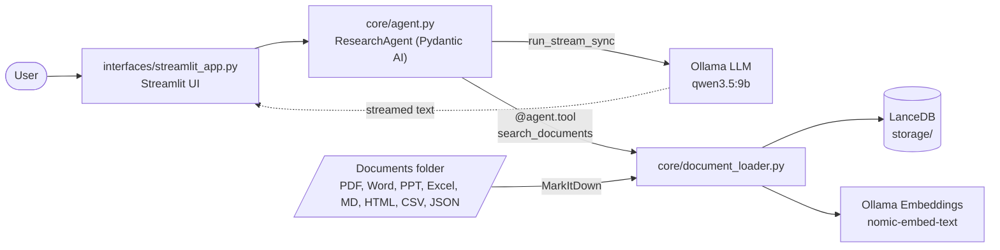
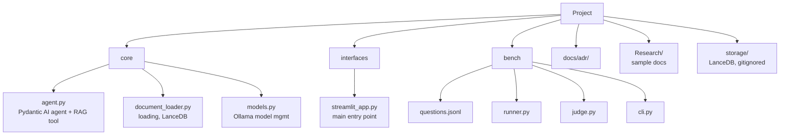
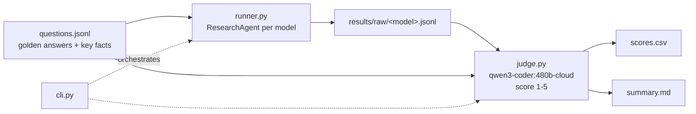

# Architecture Diagram

Mermaid view of [ARCHITECTURE.md](ARCHITECTURE.md).

## Runtime flow

```mermaid
flowchart LR
    User([User]) --> UI["interfaces/streamlit_app.py<br/>Streamlit UI"]
    UI --> Agent["core/agent.py<br/>ResearchAgent (Pydantic AI)"]
    Agent -->|run_stream_sync| LLM["Ollama LLM<br/>qwen3.5:9b"]
    Agent -->|"@agent.tool<br/>search_documents"| Loader["core/document_loader.py"]
    Loader --> DB[("LanceDB<br/>storage/")]
    Loader --> Emb["Ollama Embeddings<br/>nomic-embed-text"]
    Docs[/"Documents folder<br/>PDF, Word, PPT, Excel, MD, HTML, CSV, JSON"/] -->|MarkItDown| Loader
    LLM -.->|streamed text| UI
```

## Project structure

```mermaid
flowchart TB
    Root[Project]
    Root --> core
    Root --> interfaces
    Root --> bench
    Root --> adr["docs/adr/"]
    Root --> Research["Research/<br/>sample docs"]
    Root --> storage["storage/<br/>LanceDB, gitignored"]

    core --> agent["agent.py<br/>Pydantic AI agent + RAG tool"]
    core --> loader["document_loader.py<br/>loading, LanceDB"]
    core --> models["models.py<br/>Ollama model mgmt"]
    interfaces --> st["streamlit_app.py<br/>main entry point"]
    bench --> questions["questions.jsonl"]
    bench --> runner["runner.py"]
    bench --> judge["judge.py"]
    bench --> cli["cli.py"]
```

## Benchmark flow

```mermaid
flowchart LR
    Q["questions.jsonl<br/>golden answers + key facts"] --> R["runner.py<br/>ResearchAgent per model"]
    R --> Raw["results/raw/&lt;model&gt;.jsonl"]
    Raw --> J["judge.py<br/>qwen3-coder:480b-cloud<br/>score 1-5"]
    Q --> J
    J --> CSV["scores.csv"]
    J --> Sum["summary.md"]
    CLI["cli.py"] -.orchestrates.-> R
    CLI -.-> J
```
