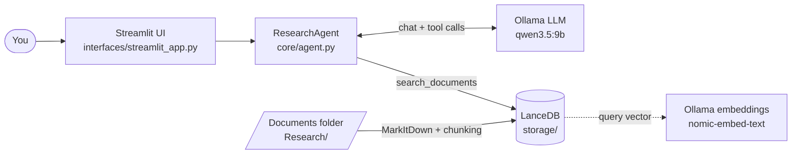
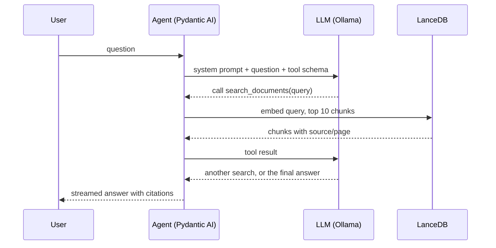
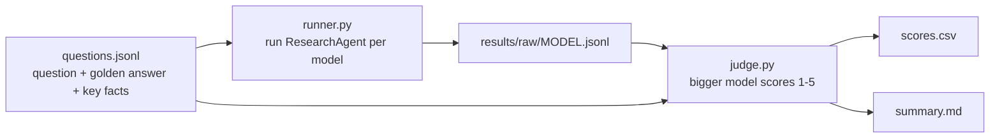

# Local LLM with RAG: A Detailed, Step-by-Step Guide

Audience: someone who just forked this repo and wants to really understand it.
Every claim below points to the file where you can verify it. Read this once,
then open the code with this guide beside it.

## 1. The problem this project explores

A Large Language Model (LLM) only knows what it saw during training. It does not
know **your** PDFs, reports or spreadsheets, and if you ask about them it may
invent ("hallucinate") an answer.

**RAG (Retrieval-Augmented Generation)** fixes this in two steps:

1. **Retrieve**: find the passages of your documents that are relevant to the
   question.
2. **Generate**: give those passages to the LLM and ask it to answer *using them*.

Classic RAG always retrieves, once, for every question. This project is an
experiment in **agentic RAG**: the LLM itself decides *whether* to search, *what*
to search for, and *how many times*. Searching is just a tool the model may call,
like a person deciding to open a drawer.

Everything runs locally: no cloud API keys, your documents never leave the
machine.

## 2. Vocabulary you need (the glossary)

| Term | Plain meaning | Where it shows up here |
|------|---------------|------------------------|
| **LLM** | The language model that writes answers | `qwen3.5:9b` (default) |
| **Ollama** | A local server that runs LLMs and embedding models | `http://localhost:11434` |
| **Embedding** | A list of numbers (a vector) that captures the *meaning* of a text; similar meanings give nearby vectors | `nomic-embed-text`, 768 numbers per text |
| **Chunk** | A small piece of a document (here 1000 characters) | `core/document_loader.py` |
| **Vector store** | A database that finds the chunks whose vectors are closest to a query vector | LanceDB, folder `storage/` |
| **Tool calling** | The model answers "please run function X with these arguments" instead of text; our code runs it and returns the result | `search_documents` |
| **Agent** | An LLM plus tools plus a loop: think, call tool, read result, repeat, answer | Pydantic AI `Agent` |
| **System prompt** | Standing instructions given to the model before the user's question | `core/agent.py` |
| **Streaming** | Showing the answer token by token as it is generated | `run_stream_sync` |
| **LLM-as-judge** | Using a stronger model to grade another model's answers | `bench/judge.py` |

## 3. The big picture

There are three actors: the **user interface**, the **agent**, and two **local
model services** (the chat LLM and the embedding model, both served by Ollama).
Documents live in a **vector store**.



Two separate life cycles exist, and keeping them apart is the key to
understanding the code:

- **Indexing (offline, once per folder):** read documents, cut them into chunks,
  compute an embedding for each, store everything in LanceDB.
- **Answering (online, once per question):** the agent searches the store, reads
  the results and writes an answer.

## 4. Life cycle 1: indexing documents

File: `core/document_loader.py`. Follow one document through the pipeline.

### Step 1: find files

`load_documents(path)` walks the folder recursively (`rglob`) for every extension
in `SUPPORTED_EXTENSIONS`: `.pdf .docx .pptx .xlsx .md .html .csv .json`. If the
folder does not exist it raises `FileNotFoundError`.

### Step 2: convert to text

`load_file(path)` calls **MarkItDown** (Microsoft's converter), which turns almost
any office format into Markdown text. If a file fails to convert, a warning is
logged and the file is skipped; one bad file never stops indexing.

### Step 3: cut into chunks

`split_text(text, chunk_size=1000, overlap=100)` slices the text into windows of
1000 characters, each starting 900 characters after the previous one. The
100-character **overlap** keeps a sentence that straddles a boundary intact in at
least one chunk.

```text
text:    |-------- 1000 --------|
chunk 2:                 |-------- 1000 --------|
                         ^ starts 900 chars in (100 overlap)
```

Each chunk becomes a record: `{"text": ..., "source": "<path>", "page": 1}`.

> **Known limitation:** `page` is always `1`. MarkItDown returns the whole file as
> one text, so page numbers are not preserved. The agent's citations
> `[Source: ..., Page: ...]` are therefore reliable for the *file* but not for the
> page. (Plan 001 aims to cite exact files and lines.)

### Step 4: embed and store

The `Document` class is a LanceDB model with three fields: `text`, `source`,
`page`, plus `vector` (768 numbers). The line

```python
text: str = _default_embedding_func.SourceField()
```

tells LanceDB "compute the vector from this field automatically". So
`table.add(raw_documents)` triggers calls to Ollama's `nomic-embed-text` for every
chunk; you never call the embedding model yourself during indexing.

`load_documents_into_database` drops any existing `documents` table, recreates it
and adds all chunks. The data is written under `storage/lancedb` (gitignored).

### Details worth knowing

- One **singleton connection** (`get_db_connection`) is shared, because opening
  several connections while tables are dropped and recreated caused stale file
  references.
- `reload=False` re-opens the existing table instead of re-embedding everything;
  this is why switching the chat model does not trigger a slow re-index.

## 5. Life cycle 2: answering a question

File: `core/agent.py`. The central class is `ResearchAgent`.

### The agent object

```python
model = OpenAIChatModel(
    model_name=self.llm_model,
    provider=OllamaProvider(base_url="http://localhost:11434/v1"),
)
self.agent = Agent(model, deps_type=AgentDeps, system_prompt="...")
```

Ollama exposes an OpenAI-compatible API under `/v1`, so Pydantic AI talks to it
with its OpenAI client. `AgentDeps` carries what tools need at run time (here the
vector store) so tools stay free of global state: this is Pydantic AI's
**dependency injection**.

### The system prompt (the agent's behaviour contract)

It tells the model to: always use `search_documents` for document questions and
never rely on its own knowledge; write complete, self-contained queries (no
pronouns, because each search is independent); split compound questions into
several focused searches; stop after about 2-3 searches; say so explicitly if the
documents do not contain the answer; and cite as `[Source: ..., Page: ...]`.

Much of the project's quality depends on this prompt plus the model's ability to
follow it.

### The tool

```python
@self.agent.tool
async def search_documents(ctx: RunContext[AgentDeps], query: str) -> str:
    query_embedding = embedding_func.compute_query_embeddings(query)[0]
    results = ctx.deps.vector_store.search(query_embedding).limit(10).to_list()
    ...
```

Reading it line by line:

1. The model decided to search and produced a `query` string.
2. The query is embedded with the **same** embedding model used at indexing time
   (otherwise vectors would not be comparable).
3. LanceDB returns the **10 nearest** chunks.
4. They are formatted as text blocks (`--- Result N ---`, `Source: ..., Page: ...`,
   the chunk) and returned to the model as the tool result.

The function's docstring and type hints are not decoration: Pydantic AI turns them
into the tool description the model sees.

### The loop in one picture



The model may repeat "call tool, read result" several times before answering.
That repetition is what makes this *agentic*.

### Chat handlers and streaming

`get_streaming_chat_handler` returns a generator function. Inside,
`agent.run_stream_sync(...)` starts the run and `response.stream_text()` yields the
**cumulative** text so far ("Hel", "Hello", "Hello w", ...). The code keeps
`last_text` and yields only the new part, `text[len(last_text):]`, so the UI can
append deltas.

With `include_tool_calls=True` it first yields `("tool_call", {...})` events (taken
from `ToolCallPart`s in `response.new_messages()`), then `("text", delta)` events.
That is how the UI can display "Searching: ..." lines. There is also a plain
non-streaming `get_chat_handler` using `run_sync`.

Two safety valves are passed in by the caller:

- `model_settings`: provider options, e.g. turning off qwen3 "thinking mode".
- `usage_limits`: `UsageLimits(tool_calls_limit=N)` stops runaway search loops.

### The factory

`create_research_agent(llm_model, embedding_model, documents_path, reload)` builds
the vector store (re-index or reuse) and returns a ready `ResearchAgent`.

## 6. The Streamlit app

File: `interfaces/streamlit_app.py`. Streamlit **re-runs the whole script from top
to bottom on every interaction**, so anything that must survive lives in
`st.session_state`. Read the file in this order:

1. **Constants:** `APP_MODEL_SETTINGS` disables qwen3 thinking
   (`enable_thinking: False`, avoiding 8K+ token runaway generation);
   `APP_USAGE_LIMITS` allows at most **4 tool calls** per question.
2. **Model list:** `get_list_of_models()` (in `core/models.py`) asks Ollama for all
   local models and keeps only those whose capabilities include `tools`.
3. **Sidebar:** New Chat button, model dropdown (default `qwen3.5:9b`), documents
   folder (default `Research`), Re-index button, "Loaded N document chunks".
4. **Agent (re)creation:** the agent is rebuilt when the model or folder changes.
   Only a *folder* change (or first load) re-indexes. Missing models are pulled
   automatically by `check_if_model_is_available`.
5. **History:** messages are stored as plain dicts and converted to Pydantic AI
   `ModelRequest`/`ModelResponse` objects (`convert_to_pydantic_messages`) so the
   model sees the conversation. The current question is excluded from history
   because it is passed separately.
6. **Chat loop:** on a new question, `st.status` shows "Thinking...", each
   `tool_call` event prints `🔍 query`, text events are appended to a placeholder,
   and the label ends as "Searched N queries".

## 7. The benchmark harness

Directory `bench/`. Question: *which local model works best as the agent?*



- **`questions.jsonl`**: each line has `id`, `category`, `question`,
  `reference_answer` and `key_facts` (what a correct answer must contain). The
  questions are about the PDFs in `Research/` (e.g. "How many agents populate the
  Smallville sandbox?").
- **`runner.py`**: runs each question through a real `ResearchAgent`, capturing the
  answer text, number of `search_documents` calls, total time and time to first
  text.
- **`judge.py`**: builds a prompt with the question, golden answer, key facts and
  the candidate answer and asks a judge model for JSON
  `{"score", "covered_facts", "reasoning"}`. Score scale: 5 excellent ... 1 wrong;
  hallucinations are penalised; an empty answer is automatically 1.
- **`cli.py`**: orchestrates the phases (run, then judge) and writes
  `scores.csv` and `summary.md` under `bench/results/`.

Typical use:

```bash
uv run python -m bench --limit 2 -v     # quick smoke test
uv run python -m bench --models qwen3:8b qwen3.5:9b --judge qwen3-coder:480b-cloud
uv run python -m bench --skip-run       # re-judge saved answers only
```

Why it matters: README-level claims such as "qwen3.5:9b is best" come from this
harness, and every future change (new tools, new backend) should be compared
against a baseline from it.

## 8. Repository map

| Path | Purpose |
|------|---------|
| `core/agent.py` | Agent, system prompt, `search_documents`, chat handlers |
| `core/document_loader.py` | Load, chunk, embed, store; LanceDB access |
| `core/models.py` | Ask Ollama which models exist, pull missing ones |
| `interfaces/streamlit_app.py` | Web UI (main entry point) |
| `bench/` | Evaluation harness |
| `Research/` | Sample PDFs used by default and by the benchmark |
| `storage/` | LanceDB data (generated, gitignored) |
| `docs/ARCHITECTURE.md` | Short architecture reference |
| `docs/adr/` | Architecture Decision Records (why choices were made) |
| `docs/plans/` | Written plans for upcoming work |
| `scripts/start_llm_servers.sh` | Helper for the planned llama.cpp backend |
| `.claude/napkin.md`, `CHANGELOG.md`, `CLAUDE.md` | Workflow notes for the AI assistant and maintainers |

## 9. Where the project is heading

Two plans in `docs/plans/` (still proposals; no code yet):

- **001 Precision search**: give the agent filesystem tools (list, grep, read file
  ranges), an iterative loop and hybrid retrieval, so it can cite exact files and
  lines, closer to how Claude Code reads a codebase.
- **002 Hybrid backend**: serve the chat LLM with `llama.cpp` on the GPU while
  keeping Ollama for embeddings on the CPU. Phase 0 is a throwaway tool-calling
  spike before any code changes; the decision will be recorded in ADR 0002.

## 10. Hands-on path (do these in order)

1. **Run it.** `uv sync`, start Ollama, then
   `uv run streamlit run interfaces/streamlit_app.py`. Ask a question about the
   PDFs in `Research/` and watch the `🔍` search lines.
2. **Break the agent on purpose.** Ask something unrelated to the documents; see
   whether it searches and whether it admits the answer is not there.
3. **Look at the retrieval.** In a Python shell, import
   `core.document_loader`, open the table and print a few `source` and `text`
   values to see what a chunk really looks like.
4. **Change one knob** (`CHUNK_SIZE`, `limit(10)`, or one line of the system
   prompt), re-index, and rerun `uv run python -m bench --limit 2 -v`. Compare.
5. **Read the plans** in `docs/plans/` to see how the maintainers want to evolve it.

## 11. Common questions

- **Why not just paste all documents into the prompt?** Local models have limited
  context windows and get slower and less accurate with long prompts; retrieval
  sends only what is relevant.
- **Why two Ollama models?** One generates text (the LLM), the other converts text
  to vectors (the embedder). They are different kinds of model.
- **Why can a model fail here?** It must support tool calling; weak or sparse
  models may never call the tool or loop forever. That is why the app filters by
  the `tools` capability and caps tool calls.
- **Why are page numbers wrong?** See the limitation in section 4.
- **Where do I record a design decision?** A new file in `docs/adr/` (do not edit
  accepted ones).

## 12. One-paragraph summary

Documents are converted to Markdown, cut into 1000-character chunks, embedded with
`nomic-embed-text` and stored in LanceDB. When you ask a question, a Pydantic AI
agent backed by a local Ollama LLM may call `search_documents`, which embeds the
query and returns the 10 nearest chunks; the model reads them, optionally searches
again, and streams back an answer with citations. A benchmark harness scores
different models on a fixed question set, and two planned changes aim to make the
search more precise and the inference faster.
