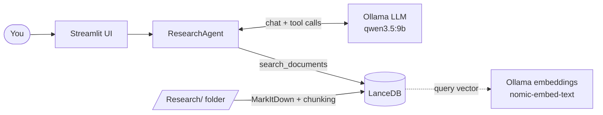
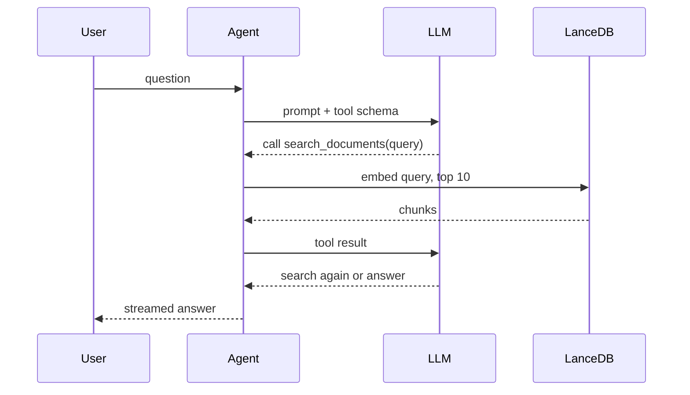
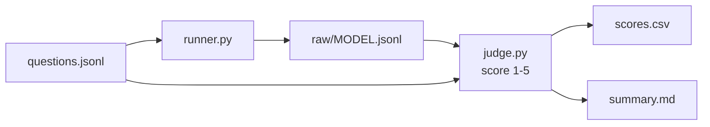

# Local LLM with RAG, Explained

## Who this is for

- You forked the repo and read the architecture, but it did not click yet
- Goal: understand **what happens, in what order, and why**
- We follow one question from the browser to the answer
- Companion document: `01-detailed-guide.md` (more depth, same order)

## The problem

- An LLM only knows what it saw in training
- It does not know **your** PDFs and reports
- Asked about them, it may invent an answer (hallucination)
- We need a way to hand it the right passages at question time

## The idea: RAG

- **R**etrieval: find the passages of your documents that match the question
- **A**ugmented: put those passages into the prompt
- **G**eneration: the LLM writes the answer using them
- Analogy: an open-book exam instead of an exam from memory

## What is different here: agentic RAG

- Classic RAG: always search once, then answer
- Agentic RAG: **the model decides** whether, what and how often to search
- Searching is a *tool* the model can call, like opening a drawer
- Everything runs locally: Ollama + Pydantic AI, no cloud keys

## Words you will meet

- **Embedding**: numbers that capture the meaning of a text; similar meaning, nearby numbers
- **Chunk**: a 1000-character piece of a document
- **Vector store**: a database that finds the nearest vectors (LanceDB)
- **Tool calling**: the model asks our code to run a function
- **Agent**: LLM + tools + a loop (think, act, read, repeat)

## The big picture



## Two life cycles

- **Indexing**: happens once per folder, before any question
  - read files, cut into chunks, embed, store
- **Answering**: happens for every question
  - the agent searches the store, reads results, writes the answer
- Keeping these two apart is the key to reading the code

## Indexing step 1: find and convert

- `load_documents` walks the folder recursively
- Supported: `.pdf .docx .pptx .xlsx .md .html .csv .json`
- **MarkItDown** converts each file to Markdown text
- A file that fails is skipped with a warning; indexing continues

## Indexing step 2: chunking

- Window of **1000 characters**, moving forward **900** each time
- The 100-character overlap keeps boundary sentences whole
- Each chunk becomes `{text, source, page}`
- Why small chunks? Search can then return only the relevant part

## Indexing step 3: embed and store

- The `Document` model marks `text` as the source of the vector
- `table.add(...)` makes LanceDB call Ollama `nomic-embed-text` automatically
- Each chunk gets a **768-number** vector
- Data lives in `storage/lancedb` (gitignored)
- `reload=False` reuses the table, so switching models is fast

## A known limitation

- `page` is always **1**: MarkItDown returns the whole file as one text
- Citations `[Source: file, Page: N]` are trustworthy for the **file**, not the page
- Planned fix: plan 001 (cite exact files and lines)

## The agent

- `OpenAIChatModel` + `OllamaProvider` at `localhost:11434/v1`
- Ollama speaks the OpenAI-compatible API, so Pydantic AI reuses its client
- `AgentDeps` hands the vector store to the tool (dependency injection)
- The **system prompt** defines the behaviour

## The system prompt says

- ALWAYS use `search_documents` for document questions; never use own knowledge
- Write complete, self-contained queries (no pronouns)
- Split compound questions into several focused searches
- Stop after about 2-3 searches
- Say so if the documents do not contain the answer
- Cite as `[Source: ..., Page: ...]`

## The tool: search_documents

```python
@self.agent.tool
async def search_documents(ctx, query: str) -> str:
    vec = embedding_func.compute_query_embeddings(query)[0]
    results = ctx.deps.vector_store.search(vec).limit(10).to_list()
```

- Embed the query with the **same** model used at indexing
- Return the **10 nearest** chunks as text with source and page
- The docstring and type hints become the tool description the model sees

## One question, step by step



## Why this is "agentic"

- The arrow "LLM asks for a search" can happen 0, 1 or several times
- Zero: the model answers directly (small talk)
- Several: it splits a compound question into focused searches
- The loop ends when the model stops calling tools and writes the answer

## Streaming

- `run_stream_sync` starts the run; `stream_text()` yields the **cumulative** text
- The code keeps `last_text` and yields only the new part
- With tool events on, the UI first learns which queries were searched
- Result: "Searching: ..." lines, then the answer appearing live

## Safety valves

- `UsageLimits(tool_calls_limit=4)` in the app: no endless search loops
- `enable_thinking: False` for qwen3: avoids very long hidden reasoning
- Models are filtered by the `tools` capability in `core/models.py`
- Missing models are pulled automatically from Ollama

## The Streamlit app

- Streamlit **re-runs the whole script** on every click, so state lives in `st.session_state`
- Sidebar: New Chat, model, documents folder, Re-index, chunk count
- Agent rebuilt when model or folder changes; only a **folder** change re-indexes
- Chat history is converted to Pydantic AI messages so the model remembers

## The benchmark: which model is best?



## How the judge scores

- Each question has a golden answer and a list of **key facts**
- A larger model compares the candidate answer against them
- 5 = all facts, no hallucination, cites sources; 1 = wrong or empty
- Also captured: search count, total time, time to first text
- Use it as a baseline before changing prompts, tools or backend

## Repository map

- `core/` agent, document loader, model helpers
- `interfaces/` Streamlit app
- `bench/` evaluation harness
- `Research/` sample PDFs; `storage/` generated vector data
- `docs/` architecture, ADRs (decisions), plans (future work)

## Where it is heading

- **Plan 001, precision search**: filesystem tools (find, grep, read line ranges), an iterative loop, hybrid retrieval, exact file and line citations
- **Plan 002, hybrid backend**: llama.cpp on the GPU for the chat LLM, Ollama on the CPU for embeddings
- Both are proposals; nothing is implemented yet

## Hands-on path

- Run the app and ask about the PDFs in `Research/`; watch the search lines
- Ask something off-topic: does it search? does it admit it does not know?
- Inspect a few stored chunks in a Python shell
- Change one knob (chunk size, `limit(10)`, a prompt line), re-index, run `python -m bench --limit 2 -v`
- Read `docs/plans/` to see the intended direction

## Summary

- Documents become chunks, chunks become vectors, vectors live in LanceDB
- A local LLM, as an agent, decides when to call `search_documents`
- The tool returns the 10 nearest chunks; the model answers with citations
- A benchmark with an LLM judge compares models objectively
- Next steps: more precise search and a faster inference backend
