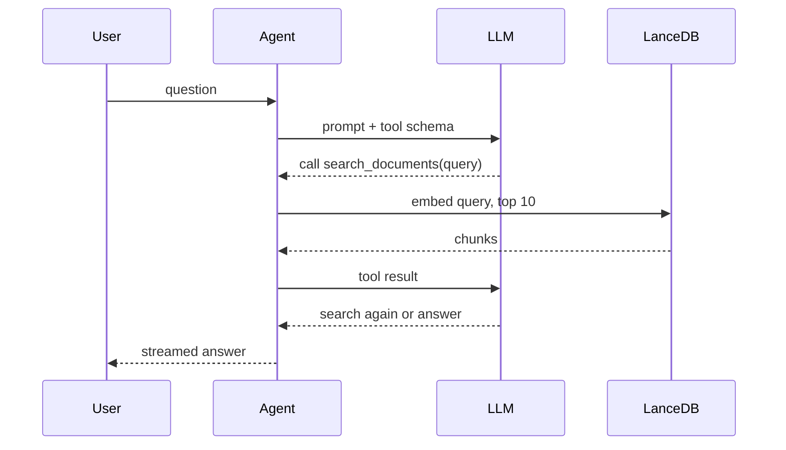

# Prompt: Mermaid sequence diagram of one question

Reusable prompt that produces the "One question, step by step" slide diagram.
Paste it into an AI assistant that can read this repo.

## Prompt

```text
Read core/agent.py (ResearchAgent and its search_documents tool) and
interfaces/streamlit_app.py. Create a Mermaid sequenceDiagram that shows what
happens, in order, when a user asks ONE question in the app.

Participants (use these short aliases and labels):
- U as User
- A as Agent
- L as LLM
- V as LanceDB

Show these steps, one arrow each, with short labels (max 5 words):
1. User sends the question to the Agent.
2. Agent sends the prompt plus tool schema to the LLM.
3. LLM replies (dashed arrow) asking to call search_documents(query).
4. Agent embeds the query and asks LanceDB for the top 10 chunks.
5. LanceDB returns the chunks (dashed arrow).
6. Agent sends the tool result back to the LLM.
7. LLM replies (dashed arrow) with either another search or the final answer.
8. Agent streams the answer to the User (dashed arrow).

Rules:
- Output only one fenced ```mermaid block, no prose.
- Use ->> for requests and -->> for replies.
- Keep it to 4 participants and 8 arrows so it fits one slide.
- Labels must match the code (search_documents, top 10), not generic RAG terms.
```

## Expected result



## Render it

```bash
/home/lw_na/md2pdf/mermaid2png.sh docs/temp/sequence-prompt.md docs/temp/sequence.png
```
